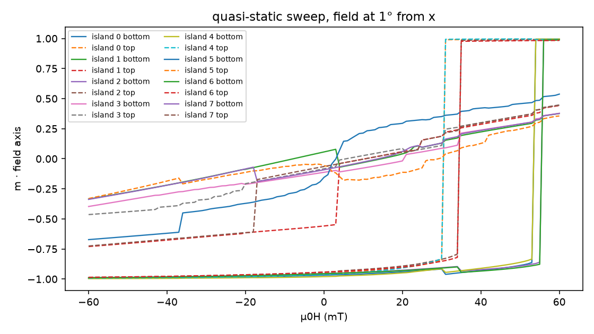
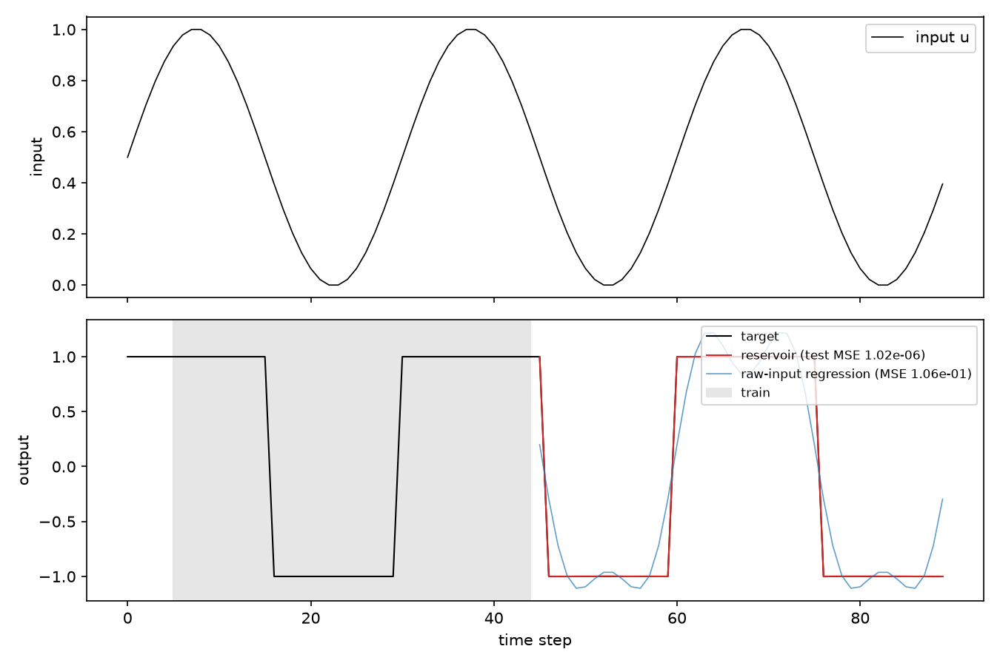
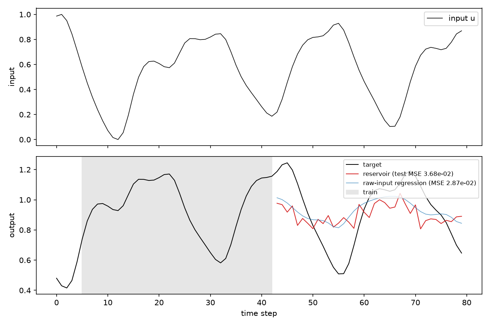
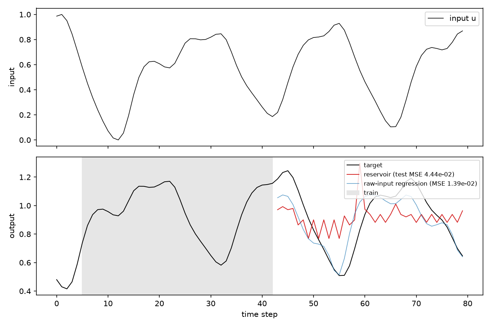
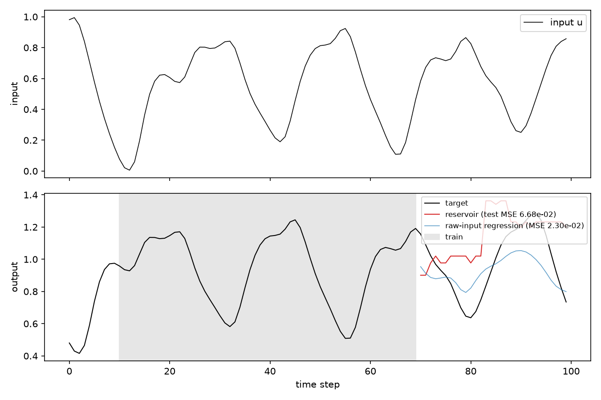

# First micromagnetic runs on Google Colab (2026-09-04)

All runs used mumax⁺ 1.2.1 through the Colab CLI (see README, "Workflow C").
Cell size 10 × 10 × 5 nm throughout (the paper's 5 nm lateral cells make the
2×2 supercell cost ~50 min per input even on an A100, see "Cost" below).
Readout: ridge regression on 80 MHz bins of the 2–14 GHz power spectrum
(150 outputs; "per-region" = 16 × 150), sequential train/test split, 5-step
washout, ridge parameter chosen on a validation slice of the training data.
"Raw input" = the same regression on (u, u², u³) of the current input.

## Hysteresis calibration (field along x + 1°)

| system | top-layer switching | bottom-layer switching |
|---|---|---|
| 1 unit cell (2 islands) | 32 mT | 35 mT (partially reversed intermediate 32–35 mT) |
| 2×2 supercell (8 islands, 2 % size disorder) | 31 and 35 mT | 54–56 mT; y-island top layers show partial (vortex-like) transitions at +4 / −17 mT |

## Reservoir runs

| run | GPU | system | protocol | task | steps | s/step | reservoir NRMSE (global / per-region) | raw-input NRMSE |
|---|---|---|---|---|---|---|---|---|
| s2sq | T4 | 1×1 | symmetric ±B loop, measured at +B, 28–36 mT | sine → square | 90 | 125 | 0.001 / 0.008 | 0.34 |
| mg10 | A100 | 2×2 | symmetric ±B loop, measured at +B, 28–38 mT | Mackey-Glass t+10 | 80 | 135 | 0.88 / 0.74 | 0.78 |
| mg10alt | A100 | 2×2 | alternating polarity, measured at −1.2 mT | Mackey-Glass t+10 | 80 | 124 | 0.97 / 3.3 | 0.54 |

## What the data say

1. **The spectral fingerprint is an excellent nonlinear basis.** The sine →
   square transformation (which needs a sign function) is learned to 1e-6 MSE
   from the spectrum measured at the loop field; the cubic raw-input baseline
   cannot do it.
2. **Symmetric loops erase memory.** On the 1×1 system the feature vectors at
   equal loop amplitude on rising and falling branches are identical to three
   decimals: a −B → +B loop ending at +B puts every switchable layer in the
   same state whatever happened before. The 2×2 system shows ~7 % history
   dependence (vortex-like states in the y-islands), but no usable past-input
   recall: reconstructing u(t−k) from the spectra is worse than from the
   current input for every k. Any "memory capacity" measured with a periodic
   or quasi-periodic input (sine, Mackey-Glass) is contaminated by the
   signal's own periodicity and must not be quoted.
3. **Alternating polarity as implemented does not help.** Each x-island top
   layer then stores the sign of the last input above its threshold, which
   for a smooth input is essentially the *parity* of the last threshold
   crossing, not an amplitude. The microstates are discrete (28 distinct
   fingerprints in 80 steps), the readout cannot generalise from 38 training
   points, and the polarity leaks into the prediction as a period-2 zigzag.
4. **Where the experimental memory comes from.** In Gartside et al. the
   memory is the progressive, stochastic evolution of the vortex population
   over many field cycles in an array of ~10⁶ islands with a spread of
   coercive fields, read out as smoothly varying mode amplitudes. A 0 K
   micromagnetic supercell of 8 perfect stadiums is deterministic and
   discrete; averaging over many disorder realisations, adding thermal
   fluctuations (`temperature`), edge roughness, and using 200–500 training
   points are the levers to make the simulation behave like the experiment.

## Suggested next experiments

* **Unipolar loops with a partial reset:** apply +B_k (unipolar), measure at
  bias, and after every input apply a fixed −B_leak that lies between the
  softest and hardest switching fields. Elements then record whether recent
  inputs exceeded their threshold since the last leak reset, giving a fading
  memory of amplitudes rather than of polarity.
* **Larger switching-field spread:** `disorder_sigma` 0.05–0.10, or an
  explicit width/length gradient, so that the input range 28–38 mT spans many
  distinct thresholds instead of two.
* **Thermal fluctuations and many seeds:** run several disorder seeds and sum
  their spectra (the flip-chip CPW measures ~10⁶ islands), and/or set a finite
  temperature in the driver so vortex nucleation becomes probabilistic.
* **More data:** ≥ 200 training points; on an A100 at 10 nm cells that is
  ~7 h for the 2×2 supercell with the adaptive stepping.

## Cost (measured)

| grid | cells | GPU | minimisation | 13 ns FMR |
|---|---|---|---|---|
| 80×80×17 (1×1, 10 nm) | 0.11 M | T4 | 0.6 s | 64 s |
| 80×80×17 | 0.11 M | A100 | 0.37 s | 33 s |
| 160×160×17 (2×2, 10 nm) | 0.44 M | A100 | 5.3 s | 82 s |
| 320×320×17 (2×2, 5 nm) | 1.74 M | A100 | 20 s | 420 s |

Minimisation count per input: 64 (symmetric ±34 mT loop, 2 mT steps),
42 with adaptive stepping (6 mT below 26 mT), ~20 for unipolar/alternating.

## Random-leak protocol runs (Sep 4-5)

| run | GPU | system | protocol | task | steps | result |
|---|---|---|---|---|---|---|
| leak0 | A100 | 2x2, 8 % disorder | unipolar write + random leak 28-38 mT, readout at -1.2 mT | MG t+10 | 80 (stopped) | readout blind: at -1.2 mT a reversed macrospin has the same Kittel frequency (R² of current input ~0) |
| leak0b | A100 | 2x2, 8 % disorder | same, readout at -20 mT | MG t+10 | 100 (stopped) | 19 discrete states, 28/30 test steps in states unseen in training, new states keep appearing (y-islands drift); no usable prediction |
| leak45 | A100 | 2x2, 8 % disorder | field at 45 deg, window 31-47 mT, random leak, readout -20 mT | MG t+10 | ~60 of 100, VM lost | 9 states in the first 20 steps, then long constant stretches (array resets only on the 45 mT avalanche) |

Lessons: (i) the readout field must separate +/- macrospins spectrally (>= 20 mT); (ii) a
fixed leak gives either infinite or zero memory per element, a random-amplitude leak gives
per-element forgetting rates; (iii) with two or three effective thresholds the state space is
a few bits and the ridge readout cannot generalise to unseen discrete states; (iv) elements
that the protocol never resets (here the y-islands at 1 deg) drift into new states and break
stationarity.

## State catalogue and cell-size scan (Sep 5)

`mumaxplus/state_catalogue.py` seeds every combination of layer states (+, -, V+, V-),
relaxes, classifies and records the energy.  Isolated 3D island, field sweep along x+1 deg:

| cell (nm) | nominal states stable | levels above the antiparallel ground state (aJ) | switching fields |
|---|---|---|---|
| 10 | 16/16 | 0.0, 26.4, 27.6, 30.7, 32.8, 36.8, 44.1, 54.7 | bottom 58; top 34 mT |
| 8 | 16/16 | 0.0, 25.2, 28.8, 29.9, 30.2, 34.7, 40.9, 43.5 | bottom 35; top 35 mT |
| 5 | 16/16 | 0.0, 25.7, 28.1, 30.2, 32.0, 36.2, 43.4, 45.9 | bottom 55; top 30 mT |
| 4 | 16/16 | 0.0, 25.8, 28.6, 30.2, 32.2, 36.5, 43.9, 46.4 | bottom 56; top 28 mT |

* All 16 textures are stable minima at every cell size; energies converge to ~0.5 aJ below 8 nm.
* Switching fields need 5 nm (4 nm agrees within 2 mT); 8 nm is a grid artefact (140 nm width is
  17.5 cells) and 10 nm overestimates the top-layer coercivity by 4-6 mT.
* Reordering fields dE/dM (the field at which the Zeeman tilt makes a state degenerate with the
  ground state): +/V 12.8, +/+ 8.5, +/V(opp) 15.3, V/- 22.2, V/+ 24.9 mT; double-vortex states
  have no net moment and cannot be addressed by a uniform field. `scripts/catalogue_analysis.py`.
* Periodic two-island unit cell at 10 nm: 252/256 seeded combinations stable, 253 distinct
  states, 102 energy levels between 0 and 96 aJ (bands by vortex count, ~20-25 aJ per vortex),
  ground states = antiparallel stacks in both islands.  At 5 nm: 248/256 stable (double-vortex
  cores better resolved), otherwise identical.

## Proxy pipeline: first transition tables (Sep 5, free T4)

Periodic two-island unit cell (10 nm cells, 4x4 PBC images), bias -20 mT, excursions bias -> +-B
-> bias with B = 24..56 mT in 8 mT steps (`--closure-only`, no spectra; ~1 min per state row on a
T4).  The closure starts from the five zero-field seeds (AP, P and mixed stacks):

| axis | states in closure | window 24-56: reachable from ground / mutually reachable core / edges | window 28-38 | window 31-47 |
|---|---|---|---|---|
| 1 deg | 15 | 3 / 4 / 20 | 2 / 1 / 3 | 2 / 1 / 9 |
| 45 deg | 11 | 11 / 5 / 18 | 1 / 1 / 0 | 3 / 1 / 4 |

* The antiparallel ground state (+/-/+/-) is a fixed point of every 45 deg excursion up to 56 mT and
  of every 1 deg excursion up to 48 mT.  Once the cell relaxes into it the protocol cannot leave it:
  the CPU automaton with the leak protocol (31-47 mT, leak 39+-8 mT) sits in the ground state 98 %
  of the time, visits 3 of 11 states, and scores NRMSE 1.0 on Mackey-Glass with zero memory.
* The 45 deg table is a hierarchy of sinks: saturated and parallel stacks cascade toward the ground
  state; the best window (40-48 mT) reaches 8 states but only 2 are mutually reachable.
* The 1 deg table has its own absorbing states (+/-/+/+, +/-/-/-, -/+/-/-, all-vortex), which is
  the discrete few-bit behaviour seen in the real reservoir runs.
* So the quantity to design against is the escape field of the ground state, i.e. the reordering
  field of the lowest level, which is above the whole protocol window.  Caveat: the 8 mT amplitude
  grid is coarse (the 28-38 window contains one sample); a 4 mT grid over 30-56 mT is the next step.

## Spacer scan (Sep 5, free T4)

Isolated island, 5 nm cells, energies relative to the antiparallel ground state, reordering field
dE/dM, and switching fields from the x+1 deg sweep (`scripts/catalogue_analysis.py`,
`scripts/switching_fields.py`).  The 70 nm spacer and the width scan (180, 220 nm) were lost with
the VM.

| level | 25 nm | 35 nm (paper) | 50 nm |
|---|---|---|---|
| +/+ parallel (aJ) | 31.7 | 28.1 | 23.9 |
| +/V+ (aJ) | 27.0 | 25.7 | 23.9 |
| +/V- (aJ) | 32.4 | 30.2 | 27.5 |
| V+/- (aJ) | 33.3 | 32.0 | 30.3 |
| V+/+ (aJ) | 38.3 | 36.2 | 33.7 |
| V+/V-, V+/V+ (aJ) | 43.9, 45.6 | 43.4, 45.9 | 42.4, 45.4 |
| B_reorder: +/+, +/V+, +/V-, V+/-, V+/+ (mT) | 9.6, 13.8, 16.5, 23.6, 26.3 | 8.4, 12.8, 15.2, 22.0, 24.8 | 7.1, 11.7, 13.6, 20.2, 22.6 |
| switching top / bottom (mT) | 28 / 58 | 30 / 55 | 31 / 52 |

* Monotonic: a thicker spacer weakens the interlayer dipolar coupling, lowers the parallel-state
  cost by ~4 aJ per 15 nm and every field-addressable reordering field by ~1.5 mT.
* At 50 nm the parallel and single-vortex levels are degenerate (23.9 aJ), the first sign of the
  clustered level structure the proxy asks for, and the two layers' switching fields converge
  (52 vs 31 mT instead of 55 vs 30).  Double-vortex levels are spacer independent (no net moment).
* All 16 textures stay stable at every spacer; the level ordering is unchanged.

### Tools

The tables and catalogues behind the numbers above are in `docs/data/<run>/` (a few kB each), so
`scripts/automaton_rc.py docs/data/trans_cell_10_45deg/transitions.json ...` and
`scripts/catalogue_analysis.py docs/data/scan_sp50/catalogue.json --window 5 40` re-run without a GPU.

* `state_catalogue.py --transitions` builds the automaton T(state, +-B) by closing the state set
  under quasi-static field excursions, with one FMR spectrum per state (`--trans-spectra`);
  `--closure-only --n-cells 2 1` does the same for a 4-island PBC cell without enumeration.
* `scripts/automaton_rc.py` runs any protocol/window through the table on the CPU: states
  reachable from the ground state, largest mutually reachable core, minimal window to reach k
  states, past-input recall and benchmark scores with the per-state spectra as features.
* Cost per geometry candidate: catalogue at 10 nm (minutes) + table (14 min for 11-15 states at
  10 nm on a T4, hours at 5 nm; FMR spectra add ~4 min per state on a T4) versus 8-15 h for a
  real reservoir run.  A single-island 5 nm catalogue with hysteresis sweep is 10-17 min on a T4.

## Operational note

The Colab CLI keep-alive daemon runs on the client; in this remote environment client processes
are killed between wake-ups, so long gaps without keep-alive let Colab reclaim the VM (lost at
~02:15 UTC Sep 5 after ~2.3 h without pings).  Fetch results eagerly and keep check-ins short.
Free-tier T4s are reclaimed after roughly 2 h regardless of keep-alive (16:09-18:00 UTC Sep 5):
order jobs by value, checkpoint tables after every row, and fetch at every check-in.
